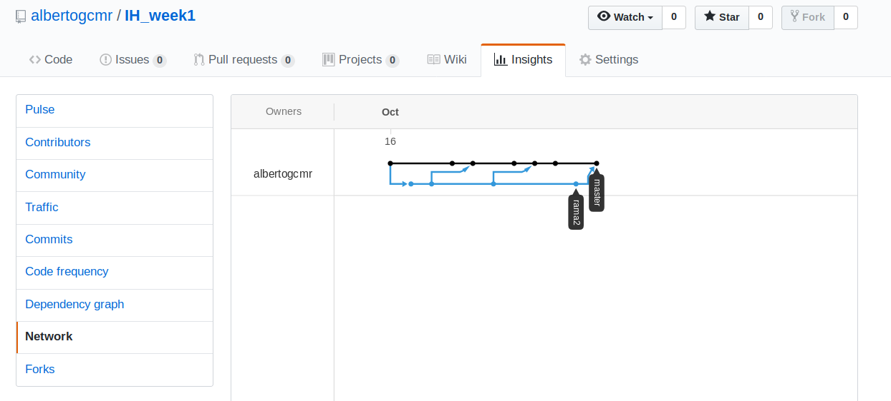

# IH week1 day2 merge example
email: garcia.cobo.alberto@gmail.com

## Pasos seguidos

Creamos la carpeta de trabajo
```
alberto@alberto-HP-Spectre-13-Ultrabook:~/Escritorio/IH/IH_week1$ mkdir ex-merge
alberto@alberto-HP-Spectre-13-Ultrabook:~/Escritorio/IH/IH_week1$ cd ex-merge/
```

Creamos contenido con visual studio. Ejecutamos la siguiente linea en terminal y procedemos a crear varios archivos
```
alberto@alberto-HP-Spectre-13-Ultrabook:~/Escritorio/IH/IH_week1$ code . 
```

Creamos un repositorio local
```
alberto@alberto-HP-Spectre-13-Ultrabook:~/Escritorio/IH/IH_week1/ex-merge$ git init
alberto@alberto-HP-Spectre-13-Ultrabook:~/Escritorio/IH/IH_week1/ex-merge$ git status
```

Creamos un nuevo repositorio en GitHub y seguimos los pasos que nos indica para vincular local y remoto

Añadimos los 3 archivos creados en al repositorio local
```
alberto@alberto-HP-Spectre-13-Ultrabook:~/Escritorio/IH/IH_week1/ex-merge$ git add README.md example.py exameple2.py
alberto@alberto-HP-Spectre-13-Ultrabook:~/Escritorio/IH/IH_week1/ex-merge$ git status
```

No hay que olvidar que si modificamos un archivo hay que volver a añadirlo
```
alberto@alberto-HP-Spectre-13-Ultrabook:~/Escritorio/IH/IH_week1/ex-merge$ git add example.py 
alberto@alberto-HP-Spectre-13-Ultrabook:~/Escritorio/IH/IH_week1/ex-merge$ git status
```

Hacemos el primer commit pero sale un error extraño
```
alberto@alberto-HP-Spectre-13-Ultrabook:~/Escritorio/IH/IH_week1/ex-merge$ git commit -am "primer commit"

*** Por favor cuéntame quien eres.

Corre

  git config --global user.email "you@example.com"
  git config --global user.name "Tu Nombre"

para configurar la identidad por defecto de tu cuenta.
Omite --global para configurar tu identidad solo en este repositorio.

fatal: no es posible auto-detectar la dirección de correo (se obtuvo 'alberto@alberto-HP-Spectre-13-Ultrabook.(none)')
```

Que se soluciona configurando tu email de usuario siguiendo los pasos indicados
```
alberto@alberto-HP-Spectre-13-Ultrabook:~/Escritorio/IH/IH_week1/ex-merge$ git config --global user.email garcia.cobo.alberto@gmail.com
alberto@alberto-HP-Spectre-13-Ultrabook:~/Escritorio/IH/IH_week1/ex-merge$ git commit -m "primer mensaje"
[master (commit-raíz) 7653f57] primer mensaje
 3 files changed, 7 insertions(+)
 create mode 100644 README.md
 create mode 100644 exameple2.py
 create mode 100644 example.py
```

Hacemos un push a github. Nos pide el nombre/password y se lo proporcionamos
```
✘ alberto@alberto-HP-Spectre-13-Ultrabook  ~/Escritorio/IH/IH_week1/ex-merge   master  git push origin master
Username for 'https://github.com': albertogcmr
Password for 'https://albertogcmr@github.com': 
Contando objetos: 5, listo.
Delta compression using up to 4 threads.
Comprimiendo objetos: 100% (3/3), listo.
Escribiendo objetos: 100% (5/5), 420 bytes | 420.00 KiB/s, listo.
Total 5 (delta 0), reused 0 (delta 0)
remote: 
remote: Create a pull request for 'master' on GitHub by visiting:
remote:      https://github.com/albertogcmr/IH_week1/pull/new/master
remote: 
To https://github.com/albertogcmr/IH_week1.git
 * [new branch]      master -> master
 alberto@alberto-HP-Spectre-13-Ultrabook  ~/Escritorio/IH/IH_week1/ex-merge   master  
```

Ahora modificamos el archivo example.py con el editor de Visual Studio, hacemos git add como otras veces y luego commit y push
```
alberto@alberto-HP-Spectre-13-Ultrabook:~/Escritorio/IH/IH_week1/ex-merge$ git add example.py
alberto@alberto-HP-Spectre-13-Ultrabook  ~/Escritorio/IH/IH_week1/ex-merge   rama2 ✚  git commit -am "hemos cambiado example.py"
[rama2 8434a6b] hemos cambiado example.py
 1 file changed, 1 insertion(+), 1 deletion(-)
alberto@alberto-HP-Spectre-13-Ultrabook  ~/Escritorio/IH/IH_week1/ex-merge   rama2  git push origin rama2
Username for 'https://github.com': albertogcmr
Password for 'https://albertogcmr@github.com': 
Contando objetos: 3, listo.
Delta compression using up to 4 threads.
Comprimiendo objetos: 100% (2/2), listo.
Escribiendo objetos: 100% (3/3), 296 bytes | 296.00 KiB/s, listo.
Total 3 (delta 1), reused 0 (delta 0)
remote: Resolving deltas: 100% (1/1), completed with 1 local object.
remote: 
remote: Create a pull request for 'rama2' on GitHub by visiting:
remote:      https://github.com/albertogcmr/IH_week1/pull/new/rama2
remote: 
To https://github.com/albertogcmr/IH_week1.git
```

Hacemos cambios, commit y push en master y rama2 respectivamente para crear conflictos pasando de rama en rama con el siguiente comando seleccionando master o rama2
```
 alberto@alberto-HP-Spectre-13-Ultrabook  ~/Escritorio/IH/IH_week1/ex-merge   rama2  git checkout master
```
Ahora hacemos merge de rama2 al master 
```
 alberto@alberto-HP-Spectre-13-Ultrabook  ~/Escritorio/IH/IH_week1/ex-merge   master  git merge rama2
 alberto@alberto-HP-Spectre-13-Ultrabook  ~/Escritorio/IH/IH_week1/ex-merge   master  git push origin master
```

Lamentablemente no ha habido conflictos, seremos más agresivos. Localizamos en google una ejemplo de conflicto
https://git-scm.com/book/es/v1/Ramificaciones-en-Git-Procedimientos-b%C3%A1sicos-para-ramificar-y-fusionar
Siguiendo el ejemplo de texto ejecutamos tras modificar el mismo archivo en master y en rama2 de una forma incompatible. 
```
alberto@alberto-HP-Spectre-13-Ultrabook  ~/Escritorio/IH/IH_week1/ex-merge   master  git merge rama2
Auto-fusionando example.py
CONFLICTO (contenido): Conflicto de fusión en example.py
Fusión automática falló; arregle los conflictos y luego realice un commit con el resultado.
```
Y finalmente obtenemos conflicto que pasamos a resolver editando el archivo correspondiente
```
<<<<<<< HEAD
<div id="footer">contact : email.support@github.com</div>
=======
<div id="footer">
  please contact us at support@github.com
</div>
>>>>>>> rama2
```
Nos quedamos con la rama2 borrando las lineas correspondientes y dejando el archivo como sigue
```
<div id="footer">
  please contact us at support@github.com
</div>
```
Seguimos la guia ofrecida por git que nos pide realizar commit
```
alberto@alberto-HP-Spectre-13-Ultrabook  ~/Escritorio/IH/IH_week1/ex-merge   master ✚ >M<  git commit
```
Y hacemos finalmente push desde el master obteniendo el siguiente grafo en la sección insights/Network


